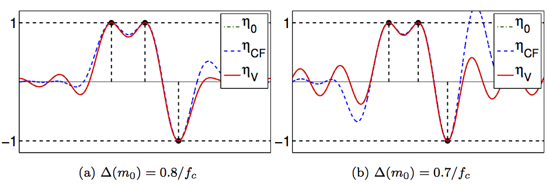

This toolbox implements the code to generate the figure of the article:

V. Duval, G. Peyré. [Exact Support Recovery for Sparse Spikes Deconvolution](https://hal.archives-ouvertes.fr/hal-00839635/). Foundations of Computational Mathematics, 15(5), pp. 1315–1355, 2015.

Copyright (c) 2013 Gabriel Peyré

======================
Description

It implements the resolution of the sparse spike deconvolution over measure following the method introduced by Candès and Fernandez-Granda. It also implements the computation of various dual pre-certificates. When these pre-certificate assume values in [-1,1], they are valid certificate and garantees the identifiability of an atomic measure, and also possibly some robustness to noise.

======================
Installation

It requires the CVX toolbox to be installed to work properly.

======================
List of scripts

test_path.m: test the resolution of the Lasso over measure using the SDP lifting.
test_certificates.m: first main contribution of the paper, display the various pre-certificates.
test_discrete.m: second main contribution of the paper, comparison of the discrete and continuous problems.
test_proximal.m : test the resolution of the dual problem using DR proximal splitting.

======================
List of functions

compute_certificate.m: compute various pre-certificates
kernel.m: [should not be used, depreciated] compute various kernels
load_diracs.m: loads various input measures for tests.
perform_lasso.m: solve the finite dimensional L^1 discrete regularization (and its dual)
perform_sdp_dual.m: solve the dual problem of the blasso (Lasso over measures)
perform_sdp_superresolution.m: solve the primal problem by root finding after solving the primal one.
plot_certificates.m: helper function for the display of the pre-certificates.
load_helpers.m: load a few helper function for Fourier transform and measurements.

toolbox/ contains useful functions.

Copyright (c) 2013 Gabriel Peyre
